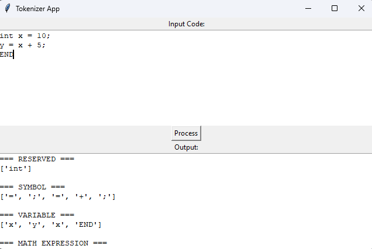
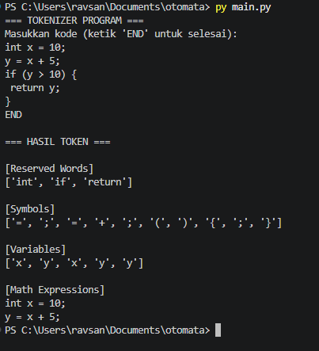
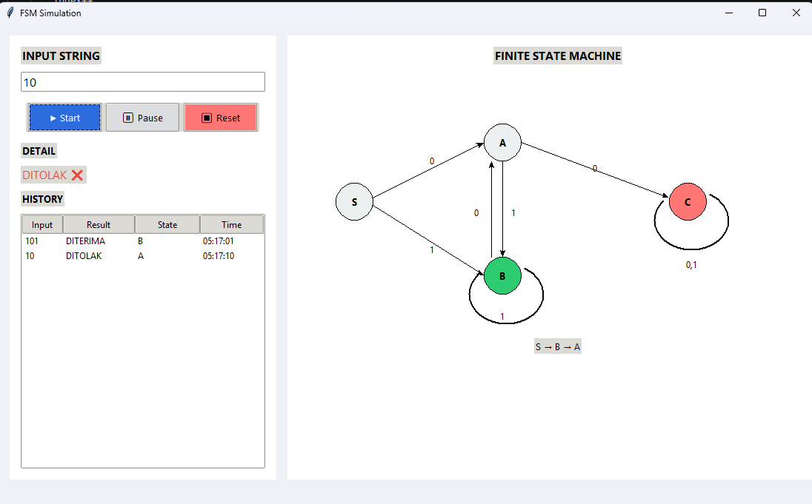

## 👥 Team

| Nama               | NRP        |
| ------------------ | ---------- |
| Muhammad Sayyidil Anam | 5025241267 |
| Abdurrahman Arrafi Ravsan Zarnadi     | 5025241241 |
| Antonius Andy Martono | 5025241191 |


---


# NO.1 🧠 Simple Tokenizer Program

---

Program ini merupakan implementasi sederhana dari **lexical analyzer (tokenizer)** yang dapat membaca input berupa kode program, kemudian memecahnya menjadi token-token dan mengelompokkannya berdasarkan kategori tertentu.

---

## 📌 Fitur Utama

* 🔍 Membaca input kode (multi-line)
* 🧩 Tokenisasi menggunakan Regular Expression (Regex)
* 🗂️ Klasifikasi token ke dalam kategori:

  * Reserved Words
  * Symbol / Tanda Baca
  * Variable
  * Kalimat Matematika
* 🖥️ Tersedia 2 mode:

  * CLI (Command Line Interface)
  * GUI sederhana (Tkinter)

---

## 🏗️ Struktur Project

```
project/
│
├── tokenizer.py   # Logic utama tokenisasi
├── main.py        # Versi CLI
└── ui.py          # Versi GUI (Tkinter)
```

---

## ⚙️ Cara Menjalankan Program

### 1. Pastikan Python sudah terinstall

Cek dengan:

```
python --version
```

---

### 2. Menjalankan versi CLI

```
python main.py
```

Masukkan kode program, lalu akhiri dengan:

```
END
```

---

### 3. Menjalankan versi GUI

```
python ui.py
```

Akan muncul window untuk input kode dan melihat hasil tokenisasi.

---

## 🧪 Contoh Input

```
int x = 10;
y = x + 5;
if (y > 10) {
    return y;
}
```

---

## 📊 Contoh Output

```
[Reserved Words]
['int', 'if', 'return']

[Symbols]
['=', ';', '=', '+', ';', '(', ')', '{', '}']

[Variables]
['x', 'y', 'x', 'y']

[Math Expressions]
x = 10;
y = x + 5;
if (y > 10) {
```

---

## 🧠 Penjelasan Singkat Algoritma

1. Program membaca input berupa teks kode
2. Menggunakan **Regular Expression** untuk memecah string menjadi token
3. Setiap token diklasifikasikan berdasarkan:

   * Kecocokan dengan reserved words
   * Pola simbol
   * Pola variabel
4. Setiap baris yang mengandung operator matematika akan dimasukkan ke kategori **math expression**

---

## 📸 Tampilan Aplikasi

### GUI (Tkinter)


### CLI


---

## 📌 Kesimpulan

Program ini dibuat untuk memenuhi tugas praktikum mengenai **tokenisasi dan klasifikasi string dalam kode program**, dengan fokus pada kesederhanaan dan kejelasan algoritma.

---

# NO.2 🧠 FSM Simulation Program (Python)

Program ini merupakan implementasi **Finite State Machine (FSM)** untuk menentukan apakah suatu string merupakan anggota dari bahasa:

```
L = { x ∈ (0 + 1)* | 
      karakter terakhir adalah 1 
      dan tidak mengandung substring "00" }
```

Program dibuat menggunakan **Python** dengan antarmuka grafis (**GUI**) berbasis Tkinter yang interaktif dan mudah digunakan.

---

## 📌 Fitur Utama

* 🔍 Validasi string hanya berisi `0` dan `1`
* 🧩 Simulasi FSM sesuai diagram state
* 📊 Menampilkan jalur state (state path)
* 🖥️ GUI interaktif (Tkinter)
* 📝 Riwayat input (history) beserta hasil

---

## 🏗️ Struktur Project

```
project/
│
├── fsm.py              # Logic FSM
├── ui.py    # GUI + animasi
└── README.md
```

---

## ⚙️ Cara Menjalankan Program

### 1. Pastikan Python sudah terinstall

Cek dengan:

```
python --version
```

---

### 2. Jalankan program

```
python ui.py
```

---

## 🧪 Contoh Input & Output

| Input  | Hasil      | Penjelasan        |
| ------ | ---------- | ----------------- |
| `1`    | ✅ Diterima | Berakhir dengan 1 |
| `101`  | ✅ Diterima | Tidak ada "00"    |
| `1001` | ❌ Ditolak  | Mengandung "00"   |
| `10`   | ❌ Ditolak  | Berakhir dengan 0 |
| `111`  | ✅ Diterima | Valid             |

---

## 🧠 Penjelasan FSM

### State yang digunakan:

* **S** : Start state
* **A** : Terakhir membaca `0`
* **B** : Terakhir membaca `1` (**Accept State**)
* **C** : Trap state (mengandung "00")

---

### Transisi:

| Dari | Input | Ke |
| ---- | ----- | -- |
| S    | 0     | A  |
| S    | 1     | B  |
| A    | 0     | C  |
| A    | 1     | B  |
| B    | 0     | A  |
| B    | 1     | B  |
| C    | 0/1   | C  |

---

## 🎬 Cara Kerja Program

1. User memasukkan string
2. Program memproses karakter satu per satu
3. FSM berpindah state sesuai input
4. State aktif ditampilkan secara visual
5. Jalur state ditampilkan dalam bentuk:

   ```
   S → A → B → B
   ```
6. Hasil akhir:

   * **DITERIMA** jika berakhir di state B
   * **DITOLAK** selain itu

---

## 📊 History

Setiap input akan disimpan dengan format:

```
input → final_state → result
```

Contoh:

```
101 → B → DITERIMA
100 → C → DITOLAK
```

---

## 📸 Tampilan Aplikasi

### GUI (Tkinter)


---

## 📌 Kesimpulan

Program ini berhasil mengimplementasikan konsep **Finite State Machine** untuk mengenali pola string tertentu secara visual dan interaktif. Dengan adanya animasi dan GUI, pengguna dapat memahami alur FSM dengan lebih mudah.
